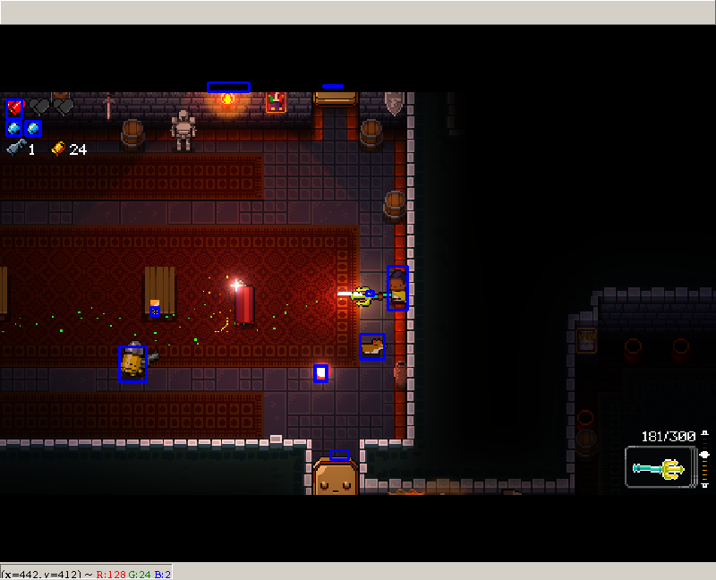

# gungeon_bot

Bot con el cual pretendo pasar el juego Enter The Gungeon.

# Funcionamiento

0. Se genera una pantalla virtual donde inicia el juego y enviar acciones.
1. Se extraen capturas de pantallas.
2. Diversos procesos independientes capturan diversas características
3. Un proceso limpia posibles errores dado los valores en el tiempo
4. Dado el estado actual generar una acción.
5. La acción es enviada mediante la librería pyautogui.

# Específicos:

## Pantalla virtual
Para evitar congelar la pantalla actual y facilitar la prueba del sistema se utiliza una pantalla virtual.
Esto es posible mediante xvfb el cual permite generar pantallas virtuales. Luego manejando la variable de entorno
DISPLAY se puede enviar procesos a esa pantalla. Es posible visualizar e interactuar con esta pantalla mediante vnc
o dejarla en background para mayor desempeño.

## Capturas de pantalla
Existen diversas formas de conseguir capturas de pantalla, pero la mayoría son demasiado lentas para esta aplicación.
Por lo tanto fue necesario interactuar directamente con X11 mediante las librerías en C++. Mediante este método se
logran extraccion de imagenes a tasa de 100 fps.

## Extraccion de caracteristicas
Para las características estáticas (vidas, balas, ubicación mira) se utilizan técnicas clásicas de procesos de imagenes.
Se toma un trozo del patrón a buscar y luego se usa esta para convolucionar con la entrada, las áreas con respuesta mayor
a 0.8 se consideran como candidatos.

Este método no funciona con los personajes los cuales tienen diversas animaciones. Para detectar a estos se utiliza una
red convolucional entrenada para ubicar posibles enemigos. Mayores detalles en clf_images.

## Rectificación en el tiempo (TODO)
Para la rectificación en el tiempo se utiliza los valores en el tiempo y se utiliza RANSAC.

## Cálculo de acciones
TODO

